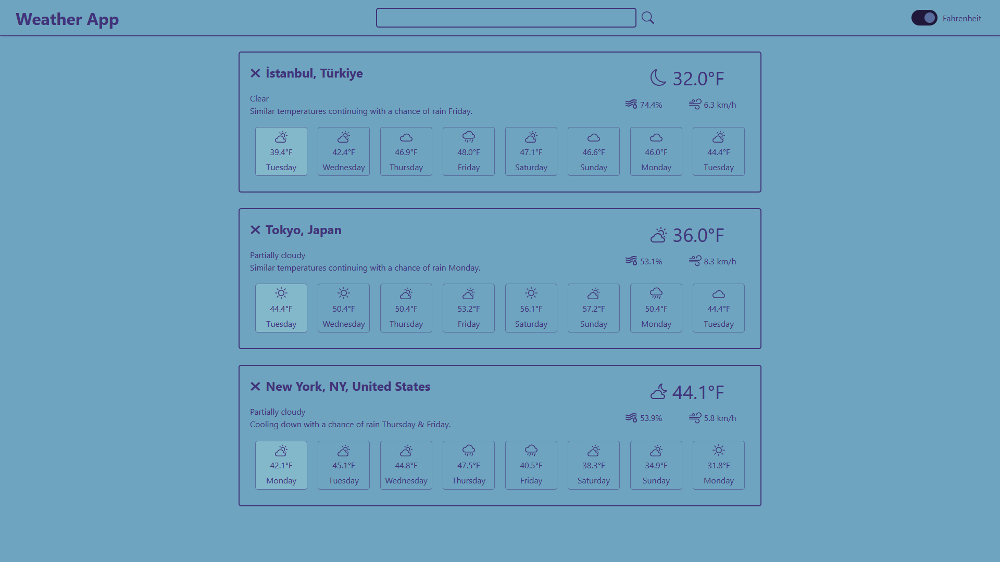

# Weather App

## Introduction

This project is a weather forecast application developed as part of The Odin Project. The app allows users to search for weather data of a specific location using the Visual Crossing API. Users can toggle the temperature display between Fahrenheit and Celsius. The interface dynamically changes based on weather conditions.

## Features

-   Search for weather information by location.
-   View current weather conditions (temperature, humidity, wind speed).
-   Toggle temperature display between Fahrenheit and Celsius.

## Live Demo

[Live Demo Link](https://emre-oktay.github.io/weather-app/)

## Screenshot

## Technologies Used

-   HTML
-   CSS
-   JavaScript
-   Visual Crossing API (for weather data)
-   Webpack
